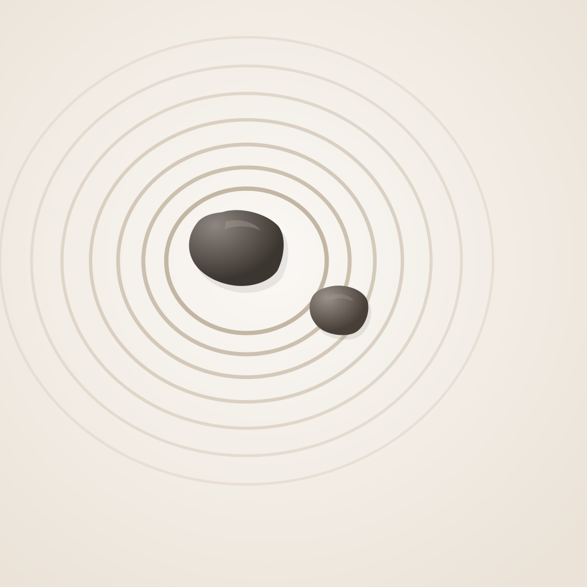

<p align="center">
  
</p>

<h1 align="center">侘び — wabi</h1>

<p align="center">
  枯山水のように、日々のルーティンを静かに整える。
</p>

---

## 概要

**wabi** は、日々のルーティンを管理・実行するデスクトップアプリです。

タスクを完了するごとに、画面上の砂粒が混沌から同心円へと整列していく — 枯山水（かれさんすい）の砂紋をモチーフにしたビジュアライゼーションで、進捗を直感的に感じ取れます。

## 特徴

### 枯山水ビジュアライゼーション
200個以上のパーティクルが、タスクの進捗に応じてリアルタイムに変化。未着手ではノイズ状に散らばり、完了に近づくにつれ美しい幾何学模様へ収束します。今日・今週・今月の3つの時間軸で同時表示。

### Markdown ベースのルーティン定義
```
## 朝のセットアップ
- 06:00 ストレッチ 10min *2
- 06:15 瞑想 15min *3
- 06:30 朝食

## 集中作業
- 09:00 ディープワーク 90min *5
- 10:30 休憩 10min
```
`## ` でフェーズ、`- ` でタスク。時刻・所要時間・重み（`*1`〜`*5`）はオプション。

### エナジーゲージ
タスクの重みに基づくスタミナバー。90%でソフトキャップがかかり、やりすぎを防ぎます。超えると「よくやった」モードに。

### 今日やらないと決めたこと
意図的に断る・後回しにするタスクを記録。やらない選択も大切な決断として扱います。

## 技術スタック

| レイヤー | 技術 |
|---------|------|
| UI | React 19 + TypeScript 5.9 |
| スタイル | Tailwind CSS v4 |
| ビルド | Vite 7 |
| デスクトップ | Electron 40 |
| ストレージ | electron-store / localStorage |
| ビジュアル | Canvas API（ライブラリ不使用） |

## セットアップ

```bash
git clone <repo-url>
cd wabi
npm install
```

### 開発モード

```bash
npm run dev
```

### ビルド（macOS）

```bash
npm run build:mac
```

## デザイン哲学

「侘び」— 不完全さ・簡素さ・無常のなかに美を見出す日本の美意識。

- **砂色のパレット**: `#faf8f5` の生成り、`#c4a882` の砂、`#2d2a26` の炭
- **静けさ**: 派手なアニメーションや鮮やかな色は使わない
- **無常**: 実行データは日ごとにリセット。毎日が新しい庭
- **余白**: 情報を詰め込まず、呼吸できる空間を残す

## ライセンス

ISC
